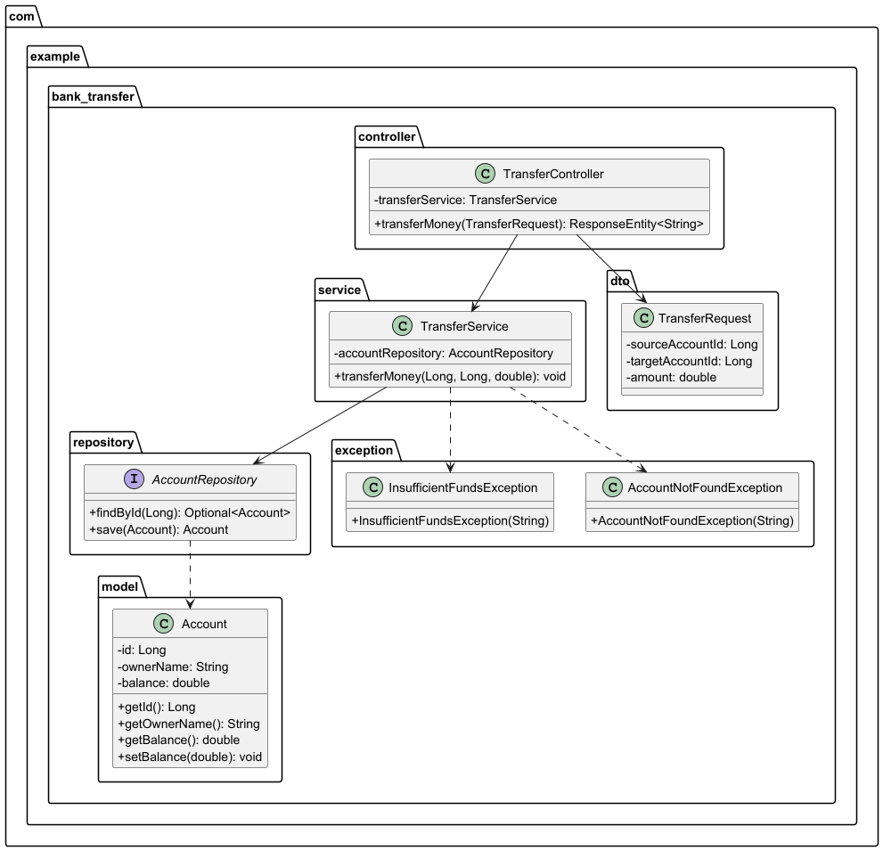

# Sistema de Transferencias Bancarias

## Diagrama de Clases


## Tecnologías
- Java 21
- Spring Boot 3.4.5
- H2 Database
- Maven

## Uso
```powershell
# Transferencia entre cuentas
$body = @{
    sourceAccountId = 1
    targetAccountId = 2
    amount = 100
} | ConvertTo-Json

Invoke-RestMethod -Uri "http://localhost:8080/api/transfer" -Method Post -Body $body -ContentType "application/json"

com.example.bank_transfer
├── controller    # Endpoints REST
├── service       # Lógica de negocio
├── repository    # Acceso a datos
├── model         # Entidades
├── dto           # Objetos de transferencia
└── exception     # Manejo de errores


### 4. Para generar la imagen del diagrama:
1. Instala PlantUML (plugin de IntelliJ o gráficamente con [planttext.com](https://www.planttext.com))
2. Exporta el diagrama como PNG y guárdalo en `docs/diagrams/`

### 5. Comandos útiles para Git:
```powershell
# Ver estado actual
git status

# Agregar cambios específicos
git add docs/diagrams/bank-transfer-uml.puml

# Hacer commit
git commit -m "Actualiza diagrama UML"

# Subir cambios
git push