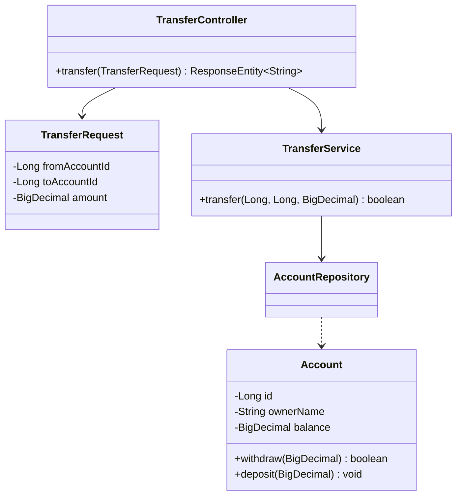

# Sistema de Transferencias Bancarias

## Diagrama de Clases



## Uso del API

### 1. Iniciar la aplicación:
```bash
mvn spring-boot:run
```

### 2. Acceder a la consola H2:
- URL: http://localhost:8080/h2-console
- JDBC URL: `jdbc:h2:mem:bankdb`
- User: `sa`
- Password: (vacío)

### 3. Realizar transferencia:
```bash
curl -X POST -H "Content-Type: application/json" \
-d '{"fromAccountId":1,"toAccountId":2,"amount":100}' \
http://localhost:8080/transfer
```

### Respuestas posibles:
- 200 OK: "Transferencia exitosa"
- 400 Bad Request: "Fondos insuficientes" o mensaje de error